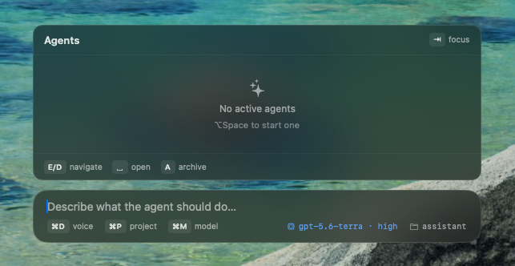
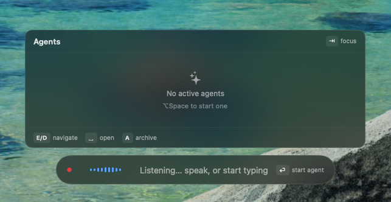
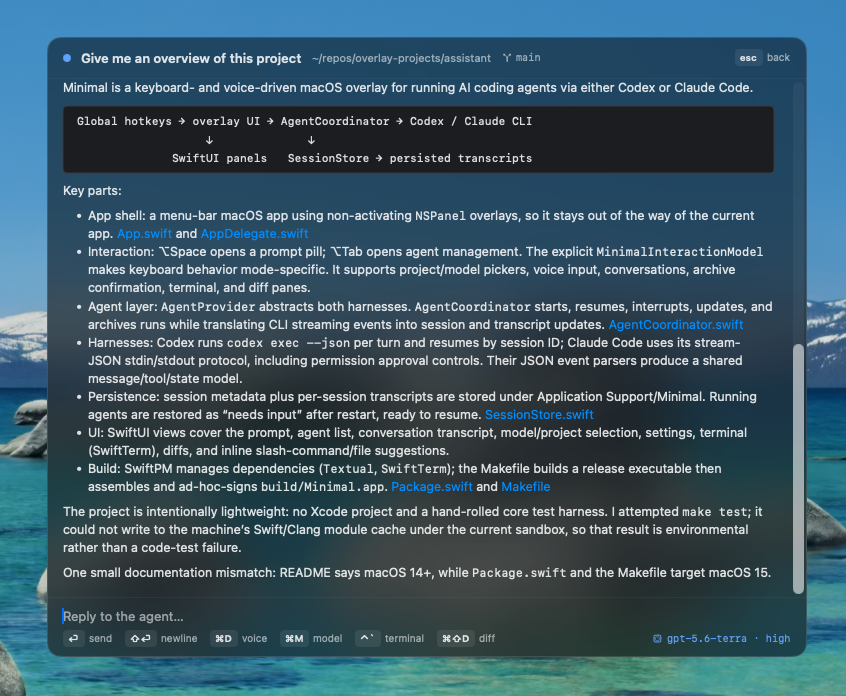
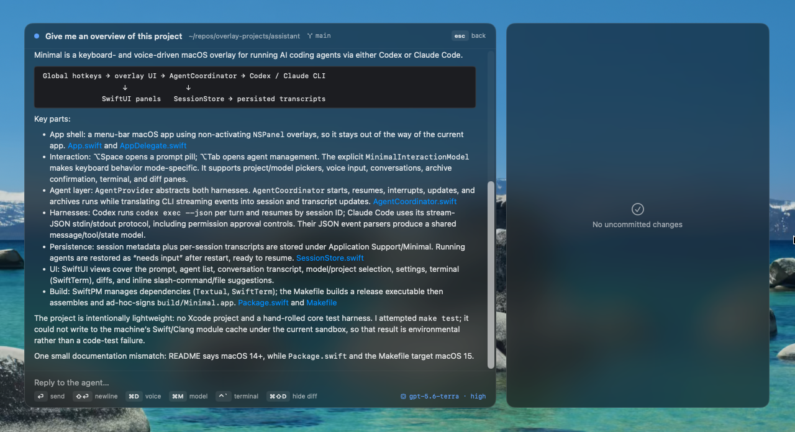

    
  <h1>Minimal</h1>
  
A simple, shortcut driven client for Claude Code and Codex.

  

## Overview

## Features

## Privacy

## Gallery

  
  
<em>Voice transcription</em>

  
  
<em>Agent viewer</em>

  
  
<em>Agent viewer with terminal</em>

  
  
<em>Agent viewer with diffs</em>

